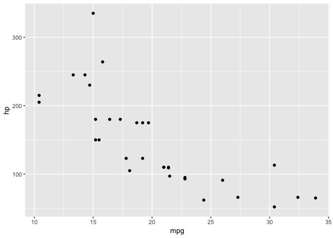

C4TS R-Club - Session 1
================
Jason Pott
17/06/2019

    ## Registered S3 method overwritten by 'rvest':
    ##   method            from
    ##   read_xml.response xml2

# C4TS R-Club

In this session: - We made sure that our Rstudio setup was working

  - we created a new [R-markdown
    document](https://rmarkdown.rstudio.com/lesson-1.html) a handy cheat
    sheet can be found
    [here](https://www.rstudio.com/wp-content/uploads/2016/03/rmarkdown-cheatsheet-2.0.pdf)

  - We customised our layout of Rstudio panes (Menu \> View \> Panes \>
    Pane Layout)


  - We started to use ggplot for graphing

  - We learnt how to bring data into R

R markdown combined text that is formatted in
[“markdown”](https://www.rstudio.com/wp-content/uploads/2015/03/rmarkdown-reference.pdf)

Rmarkdown can be output to many formats with the defaults being html,
pdf and word. Addons are available for power point and other formats.

## Installing packages

The R language includes a huge number of functions and syntax out of the
box. These “base R” functions can be added to through the installation
of other packages.

To install al package type install.packages(“nameofthepackage”) packages
must be installed once for each machine they can then be called into
active memory by loading them using the command:

library(nameofthepackage)

Note the difference between the functions in the install.packages()
function the nameofthepackage is between quotation marks both
‘nameofthepackage’ or “nameofthepackage” are valid.

Quotation marks are not needed once the package has been installed.

Install the tidyverse package you can read more about what the tidyverse
is [here](https://www.tidyverse.org)

to run commands in Rmarkdown move the cursor to the line you want torun
and press Command + Enter (on Mac) or Ctrl + Enter (on windows)

## ggplot

The next section touches on some of the concepts presented in [R for
data science](https://r4ds.had.co.nz) -
[Chapter 3](https://r4ds.had.co.nz/data-visualisation.html)

We are going to creat a graph using the ggplot package. We create a
ggplot object by calling ggplot and tell the function what data to use.

mtcars is a data set included in the tidyverse type ?mtcars in R to find
out more about it.

``` r
ggplot(data = mtcars)
```

<!-- -->

The code creates a blank box. This is the basis of a ggplot.

We can add axis to the plot using the following terms

``` r
ggplot(data = mtcars, mapping = aes(x = mpg, y = hp))
```

<!-- -->

Then we can add a visualisation of the data in question by using a geom.
Note that to do this, we chain a new line onto the ggplot function using
the + symbol

``` r
ggplot(data=mtcars, mapping = aes(x = mpg, y = hp)) + 
  geom_point()
```

<!-- -->

We can add labels and annotations using the labs function

``` r
ggplot(data=mtcars, mapping = aes(x = disp, y = hp)) + 
  geom_point() +
  labs(title = "title", y = "y", x = "x", subtitle = "subtitle", tag = "tag")
```

<!-- -->

And some color using the color/colour variable of mapping

``` r
ggplot(data=mtcars, mapping = aes(x = disp, y = hp, color = wt)) + 
  geom_point() +
  labs(title = "title", y = "y", x = "x", subtitle = "subtitle", tag = "tag")
```

<!-- --> There are
numerous types of Geom which can be used in ggplot a full list can be
seen on the ggplot [reference pages](https://ggplot2.tidyverse.org)

Each geom has default statistical transformation included as a default
behaviour.

Using the diamonds data set we can produce a histogram of the number of
diamonds by cut.

``` r
ggplot(data = diamonds, mapping = aes(x = cut)) +
  geom_bar()
```

<!-- -->

Note that in the above graph we have not given R any information about
the number of each diamond. Just that we want a bar chart where the x
axis is cut and the data set was diamonds.

The default statistic used by geom\_bar is count, read more about
geom\_bar and any R function using ?functionname i.e. `{r ?geom_bar`

If we wanted to make the same graph using data where we had already
calculated the counts of variables we would need to change the way we
use geom\_bar.

In the next code chunk I have calculated a tally of diamonds by their
cut.

``` r
test <- diamonds %>% 
  group_by(cut) %>% 
  tally()


# The next function just presents the data in a table
kable(test, "html") %>%
  kable_styling(bootstrap_options = "striped", full_width = F)
```

<table class="table table-striped" style="width: auto !important; margin-left: auto; margin-right: auto;">

<thead>

<tr>

<th style="text-align:left;">

cut

</th>

<th style="text-align:right;">

n

</th>

</tr>

</thead>

<tbody>

<tr>

<td style="text-align:left;">

Fair

</td>

<td style="text-align:right;">

1610

</td>

</tr>

<tr>

<td style="text-align:left;">

Good

</td>

<td style="text-align:right;">

4906

</td>

</tr>

<tr>

<td style="text-align:left;">

Very Good

</td>

<td style="text-align:right;">

12082

</td>

</tr>

<tr>

<td style="text-align:left;">

Premium

</td>

<td style="text-align:right;">

13791

</td>

</tr>

<tr>

<td style="text-align:left;">

Ideal

</td>

<td style="text-align:right;">

21551

</td>

</tr>

</tbody>

</table>

if we pass this to ggplot as we did before we get a graph that looks
nothing like what we were expecting.

``` r
ggplot(data = test, mapping = aes(x = cut)) +
  geom_bar()
```

<!-- --> This is
because the stat for geom\_bar has used count and so counted the number
of rows where each cut type can be found. As each cut type appears only
once the resulting value is one for each cut.

The correct way to pass the values to ggplot for the formating of the
graph is shown below but importantly stat = “identity” is used in the
function call to geom\_bar to tell it to use the values in n and not
calculate these.

``` r
# I am trying to show the default statistics functions of geoms
ggplot(data = test, mapping = aes(x = cut, y=n)) +
  geom_bar(stat = "identity")
```

<!-- -->

## Loading data into R

Loading data into R requires a consistent approach.

you need to know the precise location of a file path (the location where
a file is stored) and you need to give this to R in a way that it can
understand based on the current working directory.

``` r
getwd()
```

    ## [1] "/Users/jason/R/r4ds/01. Session 1 "

getwd() returns the current working directory where R is being used.
When working in Rmarkdown documents it will typically be where ever the
rmarkdown document is saved.

To make things easy when starting out create a new project folder for
each project that you are working on and keep your data files in the
same location.

The read.csv function can be used to read in files in csv format and it
comes from the readr package which is part of the tidyverse.

``` r
read.csv(file = "test.csv", header = FALSE) -> data
```

    ## Warning in read.table(file = file, header = header, sep = sep, quote =
    ## quote, : incomplete final line found by readTableHeader on 'test.csv'

``` r
print(data)
```

    ##   V1 V2
    ## 1  1  a
    ## 2  2  b
    ## 3  3  c

Next session we will be covering: - \[ \] working in projects  
\- \[ \] loading data files  
\- \[ \] data calculations  
\- \[ \] graph something  
\- \[ \] create a table
