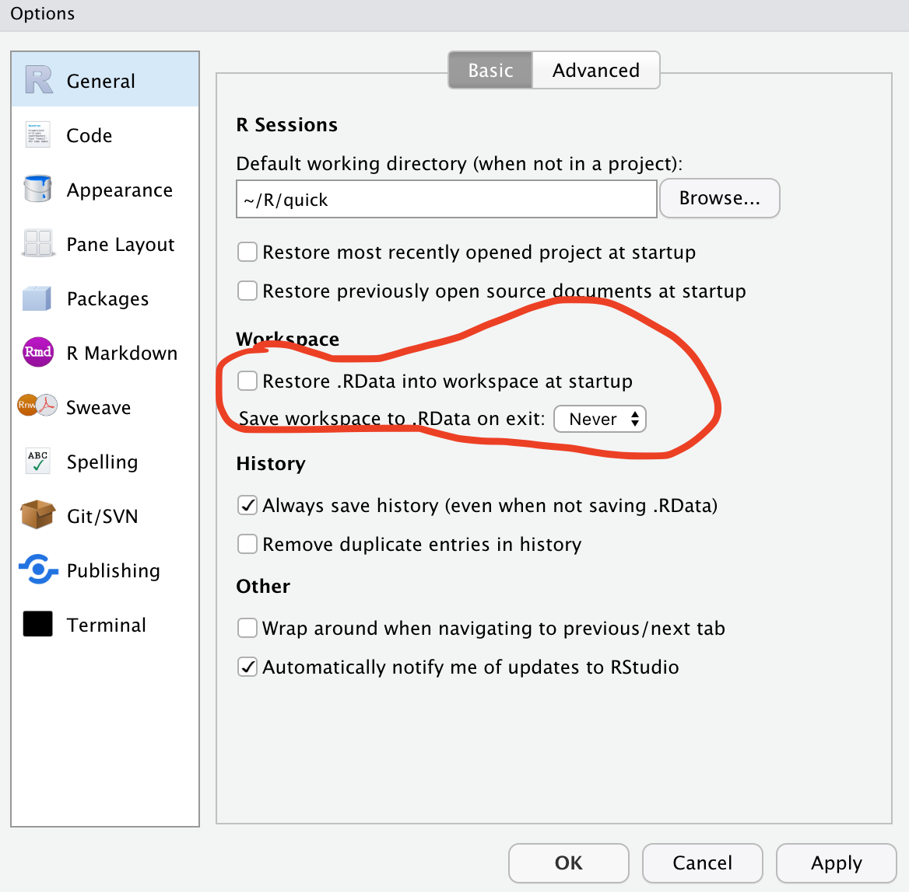

```{r setup, include=FALSE}
knitr::opts_chunk$set(echo = TRUE)
# If you have not installed the tidyverse then enter "install.packackages("tidyverse") " in the console
library(tidyverse)
```


In our [first session](https://github.com/jasonpott/r4ds/blob/master/01.%20Session%201%20/session_1.md) we covered:   
- Setting up our environment  
- installing packages  
- introduction to ggplot  
- I gave an example of how to load a csv file into R  


Feel free to look back over the notes from that session, please come back to me if you have any questions or need some clarification.


## Session 2
In this session we will work through some more useful ways of working in R and Rstudio. 

If you were not here last week the only prerequisite is to make your Rstudio look like mine.   
_Use the menus: Menu > View > Panes > Pane Layout, to acomplish this._

This week we will discuss:
- Working in projects and why you should
- Getting data into R
- Manipulating data


### Projects in R and Rstudio

Why work in projects?

Projects are the first step in ensuring that your work is reproducible. This is because each piece of analysis is wholly contained within a folder which can be shared. Sharing a copy of your analysis as a project means that it should run out of the box for other people regardless of their system setup. 

I have put together a folder template for you which you may find useful for organising your projects. This is the suggested layout of analysis projects by the ["data carpentry" group](https://journals.plos.org/ploscompbiol/article?id=10.1371/journal.pcbi.1005510).

Please download the zip file from [this link](https://github.com/jasonpott/r4ds/raw/master/02.%20Session%202/Project_template.zip)

#### Steps for project based working  
- Create a directory where you will store all your R analysis  
- Copy and unzip the file you have just downloaded  
- Name the folder - project template or something similar  
- Open Rstudio  
- File > New Project  
- If you have created a folder for your project choose existing directory, else select New directory.  

When you want to work in your project navigate to the folder and open the orijectname.Rproj

Final step - copy the contents of the template folder into your R project folder. This is how you are going to structure data within your project.

#### Other helpful settings

Within your Rstudio general preferences make sure to deselect "Restore .RData into workspace at startup" 

If this option is selected each time that you log out of Rstudio the data in your ctive R session will be saved to disk and loaded back in next time. This can cause all sorts of problems. Whenever you are running an analysis you always want to run from a fresh R session and your code should be written so that there are no pre-requisites other thant the objects and scripts that you have within your project folder.




### Importing data into R

The data types that we will cover here are:
- csv
- xls/xlsx

There are functions available to import data from SPSS files, SAS and many other formats. If you have a specific file type that you would like to import speak up and we can look for a function that serves your purpose.

read.csv is a function that is included in the tidyverse  
read.xlsx is a function included in a different package called openxlsx you will need to install this or a different package that can import microsoft excel files


```{r, include=TRUE, echo=FALSE}
write.csv(mtcars, file="testdata.csv")

data_a <- readr::read_csv(file = "testdata.csv") 

# install.packages("openxlsx") 
# If you don't have openxlsx installed locally you will need to uncomment the above line

library(openxlsx)

data_xl <- read.xlsx(xlsxFile ="testdata.xlsx", colNames = )

```


### Manipulating data

We got to this part a little late in the session so we only managed to use one function of ddplyr.

[Dpplyr](https://dplyr.tidyverse.org) is a great package for manipulating data within R. It uses a set of verbs that can be piped ( %>% ) which allows users to chain processes together.

We identified during the session that in the mtcars dataset that we imported the first column of cars does not have a column name this is because in the dataframe these values are held as row names. A useful function in another package called tibble is able to be used here rownames_to_column() this is installed as part of the tidyverse.

#### the %>% 

We make extensive use of the "pipe" which is the name given to %>% in the tidyverse. using a pipe allows the chaining of multiple functions so that multiple actions are taken for one line of code. The pipe is a central feature of the tidyverse data analysis process 

#### The filter() function

Filter is a commonly used function in dplyr. when a data set has been passed to filter using the pipe ( %>% ) you are able to call the column names individually without the usual R syntax of dataframe$columnname. You will see below that the cyl column from mtcars is named explicitly.

operators that can be used in filters are:  
- < less than  
- > greater than  
- <=less than or equal to  
- >=greater than or equal to  
- != doesnot equal  
- == equal to (note this is two equal signs together)  
- %in% exists in  


```{r, include=TRUE, echo=TRUE}

four_cyl <- mtcars %>% # pass the mtcards data frame
  rownames_to_column() %>% # add the row names to a column
  filter(cyl >= 4) %>% # filter in rows where cyl is  greater than or equal to 4
  rename(car = 1) #rename column 1 to car

four_or_less_cyl <- mtcars %>%
  rownames_to_column() %>%
  filter(cyl <=4) %>% # filter in rows where cyl is  less than or equal to 4
  rename(car = 1)

just_four_cyl <- mtcars %>%
  rownames_to_column() %>%
  filter(cyl == 4) %>% # filter in rows where cyl is equal to 4
  rename(car = 1)

```

Manipulating data will continue next session covering

- select()  
- mutate()  
- group_by()  
- tally()  
- transmute()  

We will also create some tables then pass some data to ggplot